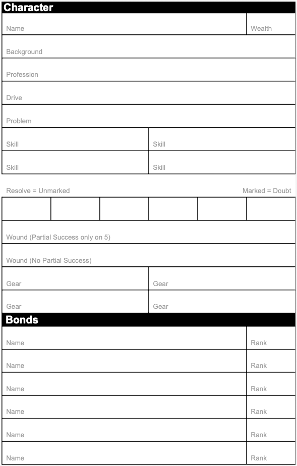
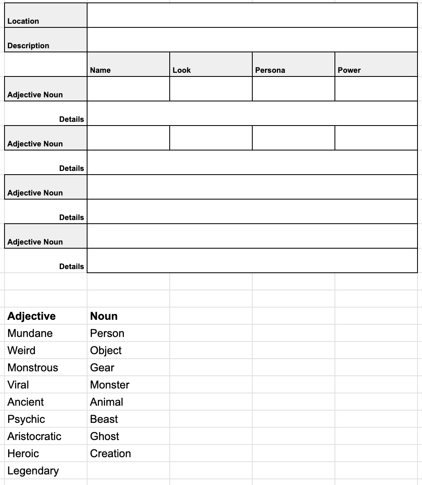

# Resolve Core

Whenever I've played an RPG, I've felt like the rules never really gave me the flexibility and ease of play that I wanted. Many rulesets have aspects that I like but none really hit the spot. This is my attempt at adapting the things I've learned into a cohesive framework that I and others can build upon easily to have fun quickly with common language and straightforward rules. Hopefully you'll find something you like here that will inspire you.

Author: Rich Winslow

## Design Principles

- Exciting moments often come from just scraping by or lucky rolls.
- Failure is a choice with clear costs.
- When the end is coming, players should be able to see it in the distance.
- Riding a death spiral should be a choice.
- Rolling high feels really good.
- Rolling a handful of dice feels really good.
- Exerting effort must get you closer to your goal.
- The mechanics should provide a consequences with varying levels of permenance.
- GMs have enough things to do with recordkeeping and storytelling, so use worksheets.
- GMs generally need a simple, clear toolbox and not railroads or finished products.

Rules here are inspired by aspects of Slugblaster, Cypher, and Legend in the Mist.

## Core

### Attributes

* 1 Profession
* 1 Background
* 4 Skills
* 6 Resolve
* 2 Wounds
* 4 pieces of Gear

### Resolution

* Resolve drama with 1d6, plus 1 additional d6 for each profession, background, skill, item, or other benefit that directly helps your action. Describe how.
* Roll and add the results. You succeed if the total meets or beats the target number, otherwise you fail.
  * 3 Untrained
  * 6 Novice
  * 9 Skilled
  * 12 Proficient
  * 15 Expert
  * 18 Master
  * 21+ Impossible
* You may spend Resolve incrementally to add dice to your result to meet or beat the target number. (Resolve details described below.)

### Special

* Each pair of 6s rolled gives you one Boost to spend in the following ways:
  * Overwhelm: Increase impact
  * Charge: Store 1d6 to use on any roll
  * Recover: Heal or reduce 1 Wound
  * Windfall: Someone recommends a benefit
* Each pair of 1s rolled gives you one Burnout and cannot mark any more Resolve unless you spend each of them in the following ways:
  * Knock: Take 1 Wound
  * Break: Mark an item you as broken
  * Doubt: Mark 1 Resolve
  * Setback: Someone recommends a problem

### Background

* Where you come from and your personal history
* If aspects of it apply to your action, add 1d6 to your dice pool

### Profession

* The job you’re trained in
* If aspects of it apply to your action, add 1d6 to your dice pool

### Skills

* What you’ve focused on being particularly good at.
* Between all the trappings of life, you only have enough time to train on 4 skills at most.
* You can learn the same Skill multiple times. Each takes up a new slot.
* If any apply to your action, add 1d6 to your dice pool for each

### Resolve

* You have 6 Resolve, representing your determination to face adversity and pursue your goals.
* Spent Resolve is called Doubt. The result of stress, fear, or inner conflict.
* When you push yourself beyond your limits, you mark Doubt to add dice.
  * You may mark 1 Doubt to add \+1d6 to a roll.
  * You may continue marking Doubt one at a time until you either:
    * Meet or beat the target number, or
    * Decide the cost isn’t worth it.
  * When you would mark more Resolve than you have, you take Trauma (see below)
* Unmarked Resolve represents your remaining willpower and composure.
* You relieve Doubt through Relief Arcs during downtime or brief respites. This represents rest, growth, and recovery.
* The GM may call for a Resolve roll or a Doubt roll depending on the fiction.
  * Resolve roll \= Roll 1d6 for each unmarked Resolve
  * Doubt roll \= Roll 1d6 for each marked Resolve

### Trauma

* When you would mark more Doubt than you have Resolve remaining, gain 1 Trauma.
  * When you take Trauma, it encapsulates all stress, fatigue, and negativity at that moment so you only ever take one at a time.
* Each Trauma occupies an Item or Skill slot whether it’s filled or not.
* You may use your Trauma like a Skill or Item.
* When you gain your 4th Trauma, your character is retired \- they’ve had enough and can’t continue.
* Trauma is only cleared with your Relief Arcs or very special Gear.

### Harm

* Harm can happen as Wounds, Doubt, lost or broken Gear, or narrative consequences.
* Wounds may have mechanical effects depending on severity; the GM will specify.
* You may mark Resolve (adding Doubt) to avoid a wound, at the GM’s discretion depending on severity.
* Wounds are recovered through items and Relief Arcs. (Quick to recover)
* Resolve is recovered by buying Relief Arcs with Doubt. (Moderate to recover)
* Trauma is only recovered at the end of Relief Arcs or special cases. (Slow to recover)

### Assist

* To help another character, describe how you do so and spend at most one Resolve to grant them \+1d6 to their roll.

### Gear

* Gear helps you solve problems and achieve goals and can come and go quickly.
* Larger items take more than one slot.
* Broken Gear must be repaired to be usable.
* You can hold at most 4 pieces of Gear

### Wealth

* To acquire something valuable, roll 1d6 for each rank in Wealth and compare the total to the item’s Value.
* If you’re short, you may offer a Favor to make up the difference.
* The size of the favor depends on how short you are; the GM decides.
* The GM may call on that favor at any time.

### Bonds

* Bonds represent the relationships that keep you grounded.
* Each Bond is ranked from 1-4. Bonds break when they reach 0\.
* To test a Bond, roll 1d6 for each rank in it.

## Making a Character

* Choose your Profession
* Choose your Background
* Choose 1 Skill
* Choose 1 piece of Gear
* Set your Wealth to 1
* Choose 2 important relationships in your life:
  * One starts at Bond 2
  * One starts at Bond 1
* Write down your motivation

### Character Sheet

## Relief Arcs

* Relief Arcs represent the moments between crises with recovery, reflection, or change.
* Each arc is a small story
  * Setup
  * Conflict/Rising Action
  * Climax
  * Resolution
* You may use downtime to:
  * Develop your Background
  * Change your Profession
  * Learn a new Skill
  * Relieve Doubt
  * Relieve Harm
  * Relieve Trauma
  * Acquire special Gear
  * Form new Bonds or strengthen existing ones
  * Work on a project

* Skill Arc
  * You’re inspired to learn something new. What is it and why? (-1 Doubt)
  * You practice but just can’t get it quite right. Mistakes are made. (-2 Doubt, \+1 Wound)
  * You delve deep in the topic but a relationship suffers. (-2 Doubt, \-1 Bond)
  * You have a breakthrough and everything clicks. Eureka. (-3 Doubt, \+1 Skill)
* Bond Arc
  * You formed a new bond or found a special moment with your existing one. (-1 Doubt, \+1 Bond)
  * You find comfort in their presence. (-1 Doubt, \-1 Wound)
  * The stress of your life tests the relationship (-1 Doubt, \+1 Wound, Roll Bond 6 to prevent \-1 Rank)
  * There’s safety in vulnerability. You reveal what’s really going on (Relieve all Doubt, \-1 Trauma, \+1 Bond, can take no other Relief action this round)
* Wealth Arc
  * Your life bleeds into your work. Someone notices something different about you. (-1 Doubt)
  * You have to make a tough call at work. (-2 Doubt, \+1 Wound)
  * You figured out how to separate work and life, but that means leaving something behind. (-3 Doubt, \+1 Wound, Forget 1 piece of Gear at home next conflict)
  * Your efforts are noticed. Management thinks you’re ready for more responsibility. (-3 Doubt, \-1 Trauma, \-All Wounds, \+1 Wealth)
* Profession Arc
  * Searching on the classifieds shows opportunity. You think about new challenges. (-1 Doubt)
  * You have an interview. Hope you can afford new clothes. (-2 Doubt, Wealth 4 to dress the part and get the job)
  * You’re fed up and quit in a blaze of glory. (-3 Doubt, \-1 Wealth)
  * First day at work. Need to learn some names and watch a training video (-3 Doubt, \+1 Wealth, New Profession)
* Memento Arc
  * You rummage around your old things and find something special. (-1 Doubt, New basic Gear)
  * You do some research to find out more. It has a history. (-2 Doubt)
  * Something about it speaks to you. You build some special connection to it. (-2 Doubt)
  * Its true power reveals itself. Name it. (-3 Doubt, Gear updated with special power)

## GM

Each location has a name, short description, and at most 4 important things there. Each is tagged with an adjective and a noun to make it easy to see what’s what. For example:

- Location: Esperanza Cove
- Description: Pink 4-plex, dated wood, smells like paella

Living things, creatures, etc. have a name, look, and persona that provide 1 or 2 word descriptions to understand the core of the character and how to represent them as a GM. The Power is the base level you’ll use for generating target numbers for challenges; it’s a way to see how influential entities are relative to each other. Details provide more color as needed. For example:

- Mundane Person
- Name: Janice
- Look: Beachbum
- Persona: Bored
- Power: 4
- Details: Praises the sun a bit too much. Reads smutty Romance novels with topless male models on them.

Gear and non-living objects obviate the need to have a look, persona, and such and simply have a proper name. They also have details that can provide more color about what the object does, how powerful it is, and any checks or conditions that must be met to get certain outcomes. For example:

- Weird Book
- Name: What's That Dead Thing?
- Details: Reference manual that helps you identify anything that's actually dead. Doubt 9 to also look up how the particular thing died.

