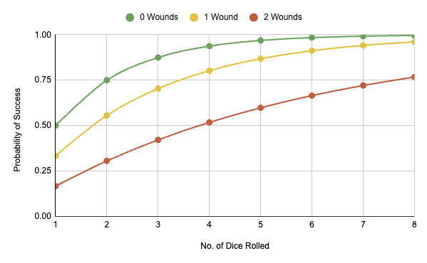

# Resolve Core

Whenever I've played an RPG, I've felt like the rules never really gave me the flexibility and ease of play that I wanted. Many rulesets have aspects that I like but none really hit the spot. This is my attempt at adapting the things I've learned into a cohesive framework that I and others can build upon easily to have fun quickly with common language and straightforward rules. Hopefully you'll find something you like here that will inspire you.

Author: Rich Winslow

## Design Principles

- Exciting moments often come from just scraping by or lucky rolls.
- Failure should have choices.
- When the end is coming, players should be able to see it in the distance.
- Players should have choices on how to ride a death spiral.
- Rolling high feels really good.
- Rolling a handful of dice feels really good.
- Waiting for everyone at the table to roll to attempt something isn't fun.
- The mechanics should provide a consequences with varying levels of permenance.
- GMs have enough things to do with recordkeeping and storytelling, so use worksheets.
- GMs generally need a simple, clear toolbox and not railroads or finished products.

Rules here are inspired by aspects of Blades in the Dark, Slugblaster, Cypher, and Legend in the Mist.

## Core

### Attributes

* 1 Profession
* 1 Background
* 4 Skills
* 6 Resolve
* 2 Wounds
* 4 pieces of Gear

### Take Action

- Take Action by rolling 1d6 + 1 extra d6 for each Profession, Background, Skill, Gear, or other benefit that helps your action. Describe how, then roll. The highest die counts.
  - 6 = Success
  - 4-5 = Success + Cost
  - 1-3 = Fail

#### _Wounds_ make it harder to succeed.
- 0 Wounds = Success + Cost on 4 or 5
- 1 Wound = Success + Cost only on 5
- 2 Wounds = No Success + Cost

#### Choose a _Boost_ when you roll a pair of 6s:
- **Overwhelm**. Increase impact.
- **Recover**. Heal or recover 1 Wound.
- **Charge**. Store 1d6 to use on any roll.
- **Windfall**. Someone thinks of a benefit.

#### _Combat_ is Taking Action with the intent to harm.
- Your opponent must take a specific number of wounds to be incapacitated. Specific Gear may have a stronger or weaker impact depending on the situation.

### Resolve

- **Resolve** is your determination, willpower and composure. You only have **6**. **Each adds 1d6 to your dice pool** and you can spend it **incrementally** on a roll until you succeed or you accept the rolled result. **Spent Resolve is called Doubt**. When you mark more Resolve than you have, take 1 Trauma.

#### Resolve and Doubt Rolls
- The GM may call for a Resolve or Doubt roll, 1d6 for each you have. Highest value counts, like with Take Action. Results here are unaffected by Wounds.

### Trauma

- **Trauma** occupies a Skill or Gear slot whether it’s filled or not, 1 slot per Trauma. When taking a Trauma, it accounts for all Harm you would accrue at that moment. You may use your Trauma like a Skill or Gear. **When you gain your 4th, your character is retired** - they cannot continue.

### Assist

- **Assist** another character by describing how and spend one Resolve to grant them +1d6.

### Background

- **Background** is your personal history.

### Profession

- **Profession** is the job you’re trained in.

### Drive

- **Drive** is what motivates you.

### Problem

- **Problem** is what haunts you.

### Skills

- **Skills** are what you're particularly good at. You only have enough time to train on 4, but you can learn the same Skill multiple times. Each occupies a new slot.

### Wounds

- Wounds are harm that happens to you. Each Wound reduces your Partial Success range by one. You may mark Resolve (take Doubt) to **Avoid** a Wound, amount determined by the GM. **When you run out of Wound slots, you take Doubt. When you run out of Resolve, you take Trauma**.

#### You _Recover Harm_ in the following ways:
- **Wounds** via Gear and Relief Arcs.
- **Resolve** via buying Relief Arcs with Doubt.
- **Trauma** via the end of Relief Arcs or special cases.

### Gear

- **Gear** helps you solve problems and achieve goals. Larger Gear takes multiple slots. Broken Gear must be repaired to be usable. You can hold at most 4 pieces of Gear.

### Wealth

- **Wealth** lets you acquire valuables. Roll 1d6 for each rank in Wealth, add the results and compare to the item’s Value. **If you’re short, you may offer a Favor** to make up the difference. The size of the favor depends on how short you are; the GM decides. The GM may call on that favor at any time.

### Bonds

- **Bonds** represent the relationships that keep you grounded. Each Bond is ranked from 1-4. Bonds break when they reach 0. To test a Bond, roll 1d6 for each rank, highest value counts.

### Relief Arcs

- Relief Arcs represent the moments between crises with recovery, reflection, or change. You spend Doubt on them to grow and recover.

## Making a Character

* Choose your Profession
* Choose your Background
* Choose 1 Skill
* Choose 1 piece of Gear
* Set your Wealth to 1
* Choose 2 important relationships in your life:
  * One starts at Bond 2
  * One starts at Bond 1
* Write down your motivation

### Character Sheet

## Relief Arcs

* Relief Arcs represent the moments between crises with recovery, reflection, or change.
* Each arc is a small story
  * Setup
  * Conflict/Rising Action
  * Climax
  * Resolution
* You may use downtime to:
  * Develop your Background
  * Change your Profession
  * Learn a new Skill
  * Relieve Doubt
  * Relieve Harm
  * Relieve Trauma
  * Acquire special Gear
  * Form new Bonds or strengthen existing ones
  * Work on a project

* Skill Arc
  * You’re inspired to learn something new. What is it and why? (-1 Doubt)
  * You practice but just can’t get it quite right. Mistakes are made. (-2 Doubt, \+1 Wound)
  * You delve deep in the topic but a relationship suffers. (-2 Doubt, \-1 Bond)
  * You have a breakthrough and everything clicks. Eureka. (-3 Doubt, \+1 Skill)
* Bond Arc
  * You formed a new bond or found a special moment with your existing one. (-1 Doubt, \+1 Bond)
  * You find comfort in their presence. (-1 Doubt, \-1 Wound)
  * The stress of your life tests the relationship (-1 Doubt, \+1 Wound, Roll Bond 6 to prevent \-1 Rank)
  * There’s safety in vulnerability. You reveal what’s really going on (Relieve all Doubt, \-1 Trauma, \+1 Bond, can take no other Relief action this round)
* Profession Arc
  * Searching on the classifieds shows opportunity. You think about new challenges. (-1 Doubt)
  * You have an interview. Hope you can afford new clothes. (-2 Doubt, Wealth 4 to dress the part and get the job)
  * You’re fed up and quit in a blaze of glory. (-3 Doubt, -1 Wealth, Lose Profession)
  * First day at work. Need to learn some names and watch a training video (-3 Doubt, +1 Wealth, New Profession)
* Gear Arc
  * You rummage around your old things and find something special. (-1 Doubt, New basic Gear)
  * You do some research to find out more. It has a history. (-2 Doubt)
  * Something about it speaks to you. You build some special connection to it. (-2 Doubt)
  * Its true power reveals itself. Name it. (-3 Doubt, Gear updated with special power)
* Wealth Arc
  * Your life bleeds into your work. Someone notices something different about you. (-1 Doubt)
  * You have to make a tough call at work. (-2 Doubt, +1 Wound)
  * You figured out how to separate work and life, but that means leaving something behind. (-3 Doubt, +1 Wound, Forget 1 piece of Gear at home next conflict)
  * Your efforts are noticed. Management thinks you’re ready for more responsibility. (-3 Doubt, -1 Trauma, -All Wounds, +1 Wealth)

## GM

### Principles

- Only you, not the players, know all of the details. None of them care where it comes from, only that they get the information they need.
- There should be enough information to make it easy to tell a great story without requiring that you follow a railroad.

### Locations

Each location has a name, short description, and at most 4 important things there. Each is tagged with an adjective and a noun to make it easy to see what’s what. For example:

- Location: Esperanza Cove
- Description: Pink 4-plex, dated wood, smells like paella

Living things, creatures, etc. have a name, look, and persona that provide 1 or 2 word descriptions to understand the core of the character and how to represent them as a GM. The Power is the base level you’ll use for generating target numbers for challenges; it’s a way to see how influential entities are relative to each other. Details provide more color as needed. For example:

- Mundane Person
- Name: Janice
- Look: Beachbum
- Persona: Bored
- Power: 4
- Details: Praises the sun a bit too much. Reads smutty Romance novels with topless male models on them.

Gear and non-living objects obviate the need to have a look, persona, and such and simply have a proper name. They also have details that can provide more color about what the object does, how powerful it is, and any checks or conditions that must be met to get certain outcomes. For example:

- Weird Book
- Name: What's That Dead Thing?
- Details: Reference manual that helps you identify anything that's actually dead. Doubt 9 to also look up how the particular thing died.

